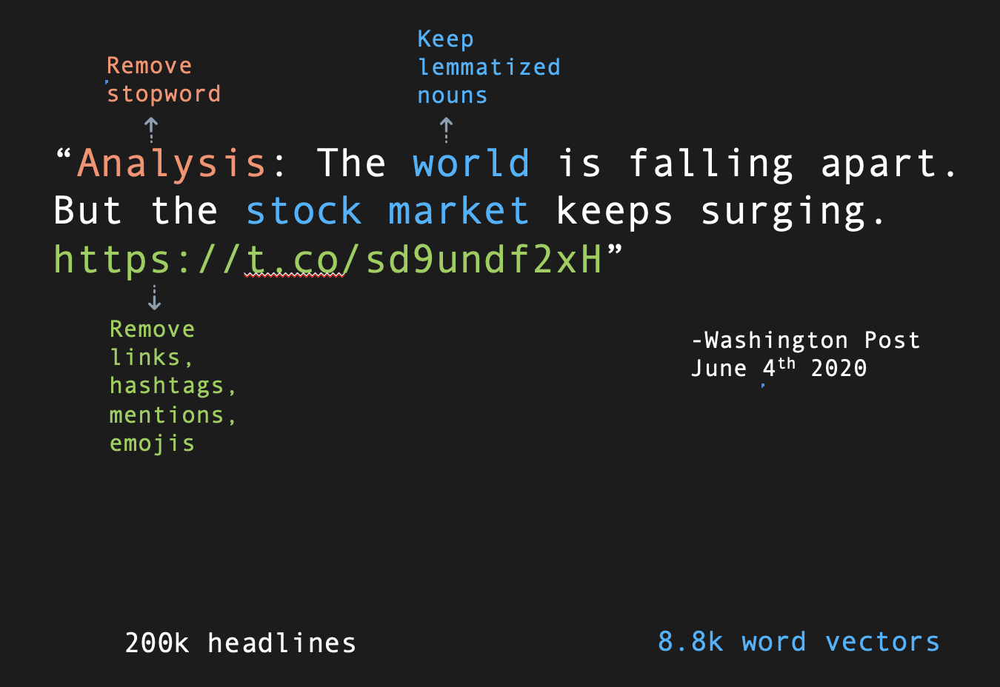
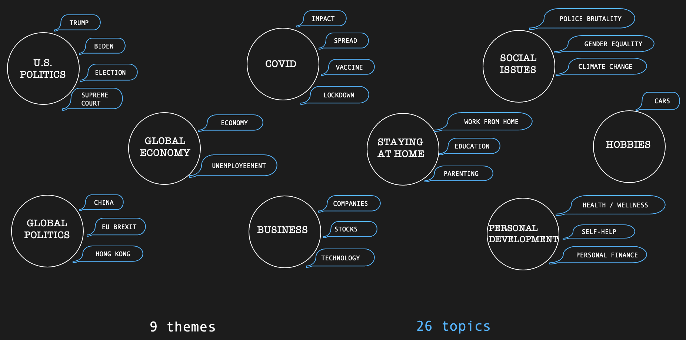
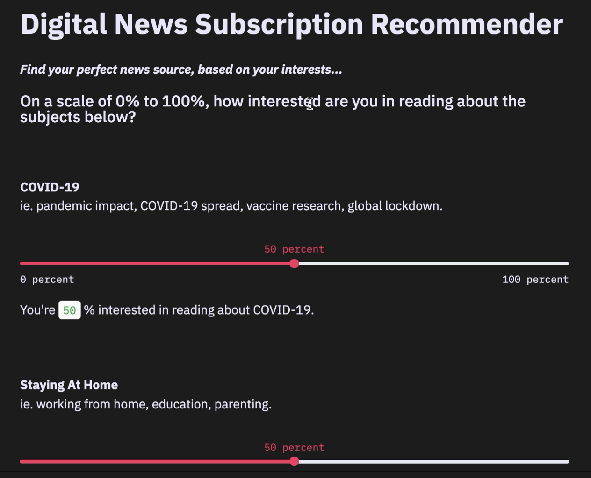

# NLP News Recommender
## Objective:

Create an interest-based news subscription recommender system through natural language processing and unsupervised topic modeling.

## Motivation:

We are spending more and more time in front of screens during quarantine. That combined with a 24/7 news cycle --and the fact that news can often be our only connection to the outside world--can lead to continuous consumption, information overload, and mental fatigue. How can we stay connected but do so in a more intentional and selective way? 

My solution was to build an app that could recommend a digital news outlet to subscribe to, based on the subjects one is most interested in reading about.

## **Tools and Approach**: 

**Scraping**
See: [1_Scraping_Tweets.ipynb](https://github.com/JuliaQiao/NLP_News_Recommender/blob/main/1_Scraping_Tweets.ipynb)

To collect headlines and article summaries from paywalled news sources within the 2 week time constraint, utilized the news sources’ tweets. News outlets aim to build their brand and convert audiences to their articles via the platform, so I felt that it was safe to assume that they would distill their best articles into each tweet (as headlines and article summaries) and present a diverse array of the articles that they believe will best promote their brand--thus, the tweets would serve as condensed samples of each news outlets’ article content. 

- Snscraper:
  - I originally scraped with Tweepy, but due to the 3200 tweet limit per account, I switched to Snscraper, a social media scraping python library. As tweets are already short documents to begin with, I wanted a large number of them for a robust dataset, to maximize the effectiveness of my topic modeling. 
  - I collected 200k tweets total, 20k each from the main accounts of the top 10 subscription based english-speaking news outlets: New York Times, Wall Street Journal, The Washington Post, The Atlantic, The Economist, The Financial Times, Business Insider, Medium, Wired, and the New Yorker.

**NLP**
See: [2_Main Notebook_Processing_Topic Modeling_Recommender.ipynb](https://github.com/JuliaQiao/NLP_News_Recommender/blob/main/2_Main%20Notebook_Processing_Topic%20Modeling_Recommender.ipynb)

- Regex:

  - Standardized and pre-processed text through regex to remove links, emojis, mentions, and unnecessary punctuation. 

- Langdetect:

  - Used langdetect to filter our all foreign language headlines.

- Spacy:

  - Sentence parsing to keep only nouns and pronouns, as these are the sentence components most indicative of topics/subjects in articles.

- NLTK:

  - Combined stop word library “english” with customized stop words which occur frequently in journalism like “reporting”, “news”, “analysis,” and filtered them out of the corpus. 

    

- TFIDFVectorizer: 

  - I chose this above CountVectorizer as it accounts for rarely used words, which is especially important in journalism. 

- Sklearn:

  - Topic modeled with NMF to generate 26 topics. I also tried LSA (LDA was not used as it works best on longer text documents) but NMF produced more nuanced topics. Topics fit neatly within 9 themes. 

    

**Recommender**

Measured topic vectors for each news outlet against user generated vector from recommender app using cosine similarity in order to generate recommended news outlet. 

- Streamlit. 
  - Created recommender app with customized color palette (HTML).

## Result:

Full demo [here](https://youtu.be/JxxYgsWlS4k)

